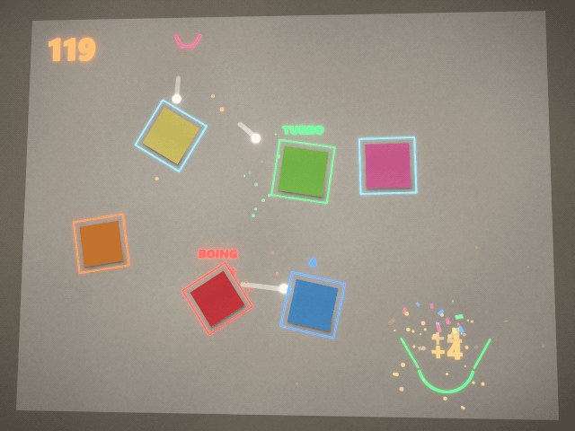

# Sticky Clash

Nederlands? Lees [README.nl.md](README.nl.md).

The game itself speaks English and Dutch: switch with the **NL | EN** buttons at the top right.

A projection-mapping game, inspired by the reel by @tejusn. Balls fall down the wall; you
steer them into the bin with real objects.

Runs entirely in the browser. Nothing to install, no libraries.

**Play online right away: https://noaquim.github.io/sticky-clash/** — open the link in
Chrome or Edge, allow the camera, done. Nothing to download or install. Rather play
without internet? Download `sticky-clash.html` (the whole game in one file) or the whole
folder via *Code → Download ZIP*.



*Simulation, not real footage: the real game code played this run; the wall, notes and camera look were added afterwards.*

Anyone may use, change and share the game (MIT license, see `LICENSE`). Want to tinker
with it yourself? Read **CUSTOMIZE.txt**.

## In short

1. Double-click **`sticky-clash.html`** (or on Windows, the shortcut / `start.bat`)
2. Click **Set up everything automatically** and allow the camera
3. Follow the instructions that appear on the wall
4. **Start round**

That's it. Calibration takes care of itself: the game projects a white area and four
dots and finds them again in the camera image on its own.

## English or Dutch

At the top right of the header bar there are two small buttons: **NL | EN**. Switching
happens at once, without reloading, and everything comes along: the panel, the status
line and the counter, the leaderboard and the name question, the phone panel, every text
on the wall, the title of the projector window and the **Photo of what the camera sees**.

- **At startup** the game uses the language you last picked with those buttons (this
  browser remembers it). Never picked one? Then it follows the browser: Dutch if the
  browser is set to Dutch, English otherwise.
- **The phone** follows its own language, without buttons: Dutch on a phone set to Dutch,
  English otherwise. Whatever the laptop sends, like the question for your name, also
  appears in the phone's language.
- **Stays Dutch:** the description in the dialog you use to install the game as an app.
  It comes from a fixed file (`manifest.webmanifest`) that can't follow the switch.

Changing texts yourself, in either language: see
[Texts and the two languages](#texts-and-the-two-languages).

## Two play modes

### Any object (default)

The game learns once what the empty wall looks like. **Anything you put in front of it
after that is an obstacle** — a book, a tray, a pizza box, a ruler, your hand. Color
doesn't matter. Use them to build a marble run and try to get as many balls as possible
into the bin.

The bin itself is recognized too and stays the goal, even if you move it during the
game.

**Forgot to take the notes off before the game learned the wall?** No problem. While
learning, the game also looks for things that were already there: small, solid things
surrounded by plain wall. Those simply count, and if you take them off, they're gone —
no ghost spot left behind. After learning, the panel tells you how many it found. A
large sheet of paper, an empty frame or the edge of the projected image doesn't count. A
colored note is found just as easily as one you put up later; something that's only
lighter or darker than the wall (a patch of light, a gray printout) has to stand out more
clearly.

> Small things that really are part of the wall — a power socket, stickers, a drawing —
> then count too. Don't want that? Turn off *Things already on the wall count too*
> (under Play mode). If the bin was already there, the wizard finds it just the same.

### Post-its · duel

Two players. Orange post-its belong to the attacker and send balls to the bin; blue ones
belong to the defender and stop them. Goal = point for the attacker; a ball that hit a
note but still misses = point for the defender. Three goals in a row gives a combo
bonus.

First teach the game the two colors under "More settings" → Colors, in the lighting
you'll be playing in.

## What you need

- A projector aimed at a plain wall
- A webcam that can see the whole projected area
- For object mode: whatever you have lying around
- For duel mode: post-its in two clearly different colors
- A bucket, wastebasket or box as the goal

## Starting — on any computer

**The whole game is in one file: `sticky-clash.html`.** Double-click it and it opens in
your browser. Nothing to install, no internet needed. You can put just that file on a
USB stick or email it; it works on its own.

| computer | how to start |
|---|---|
| **Windows** | double-click `sticky-clash.html`, or the **Sticky Clash** shortcut on the desktop |
| **Mac** | open `sticky-clash.html` with Chrome (right-click → Open With → Google Chrome) |
| **Linux** | open `sticky-clash.html` with Chrome or Chromium, or run `./start.sh` |
| **Chromebook** | open `sticky-clash.html` from the Files app |

Use **Chrome or Edge**. It hasn't been tested in Safari or Firefox; the game tells you
if you're using a different browser.

**One difference**: when you start from the single file, the browser asks for the camera
again *every* time — just click Allow. If you want it to remember, start through a small
local server. On Windows that's what `start.bat` (and the shortcut) is for; it picks the
best way by itself:

1. **Node.js** installed → `node serve.mjs`
2. otherwise **PowerShell** (on every Windows computer) → `serve.ps1`, no install and no
   admin rights needed
3. if that isn't allowed either, as on some school computers → just the single file

Both servers always use port 8123. To the browser, a different port is a different
address, and you'd lose your calibration and camera permission. If the game is already
running, they just open the page; if another program is using 8123, they open the single
file.

On a Mac or Linux, `start.command` / `start.sh` does the same (using Node.js if it's
there). After copying, make it executable first: `chmod +x start.command`.

To recreate the desktop shortcut (for example after moving the folder, or on another
Windows computer):

```bash
node maak-snelkoppeling.mjs
```

### Using an external webcam

Your laptop's camera looks at you, not at the wall. So plug in a separate webcam and put
it next to or on top of the projector, pointed at the wall.

- **Automatic:** if *Camera* (at the top, under "Set up everything automatically") is set
  to *Automatic — external webcam if there is one*, the game uses an external webcam if
  there is one, and the built-in one only if there's nothing else. A virtual camera (OBS
  and the like) comes last.
- **Plugging it in while the game is open:** the game notices the new webcam within a
  second and switches to it. Then click **Set up everything automatically**: a different
  camera sees the wall differently, so calibration and the wall have to be redone.
- **Choosing yourself:** pick the webcam from the list. That choice is remembered; the
  game then no longer switches on its own.
- **Not working?** The game tells you why: in use by another program (close Teams, Zoom,
  OBS or the Camera app), no permission (camera icon in the address bar), or unplugged.
- **No webcam?** Your phone can do it too, with a free app like DroidCam or Camo. On a
  Mac, an iPhone works as a camera right away. Put the phone down so it stays still,
  pointed at the wall.

### Projector as a second screen

Click **More settings → Projector → Detect projector screen** once and allow it. From
then on, the projector window opens on the projector by itself — even if the projector is
your main screen. After that, one click in that window for full screen; no website is
allowed to go full screen without a click. Until you've done that, a small line at the
bottom of the projected image says "Click once in this window for full screen" — but
only when nobody is playing, and as part of the image itself, so the camera doesn't
mistake it for an object. The game notices when the projected area has changed and then
recalibrates itself.

### Installing as an app

From the online version or through `start.bat` (not from the single file) you can install
Sticky Clash as a program of its own, with its own window and an icon in the Start menu.

- **Installing:** in Chrome or Edge, click the install icon at the right of the address
  bar, or the **Install as app** button at the top of the panel. That button only appears
  when the browser says it can be done.
- **Without internet:** after that, the game also starts offline — the browser keeps a
  copy of all the files. When you're online, it always fetches the newest version first:
  an update on GitHub, or your own change after F5, shows up right away. Installed through
  `start.bat`? Then the app also starts when the server isn't running (but if you want to
  see your own changes, run `start.bat` first).
- **Camera and projector:** you still need the camera. The app shares permission,
  calibration and settings with the browser on the same address, and the projector window
  opens just like it does in the browser.
- **Uninstalling:** in the app window, via the menu (⋮ or …) → *Uninstall Sticky Clash*,
  or in Windows via Settings → Apps.

### After changing the code

`sticky-clash.html` is built from `index.html`, `css/` and `js/`. After a change:
double-click **Los bestand maken** ("build single file"; Windows; uses Node.js if it's
there, otherwise PowerShell — both produce exactly the same file), or:

```bash
node bouw-los-bestand.mjs
```

`test/losbestand.mjs` fails if you forgot. Want to tinker yourself? See
**CUSTOMIZE.txt** — what's where, and the easiest changes.

### Texts and the two languages

The Dutch text is the key. It sits in the code, in the same place as always:

| where | which texts |
|---|---|
| `index.html` | the fixed texts in the panel |
| `js/main.js` | the messages in the status line, the counter under *Mark goal*, the instructions on the wall during setup, the tips on the wall and the photo of what the camera sees |
| `js/game.js` | the texts on the wall during play: banners, the level hints, BOING and TURBO, COMBO, RANGLIJST (LEADERBOARD) |
| `js/telefoon.js` | the phone line in the panel, and the messages sent to the phone |
| `js/vision.js` | the names of the colors: Aanvaller, Verdediger, Doel, Balbron (Attacker, Defender, Goal, Ball source) |
| `telefoon.html` | the page on the phone, with its own English dictionary: `const EN = {…}` |

The English is in `js/taal-en.js`, in `TAAL_EN`: on the left the Dutch sentence exactly
as it is in the code, on the right the English. How it works is in `js/taal.js`:

- `t('Dutch sentence', { naam: … })` translates and fills in `{naam}` and the like
- `tAantal(n, '{n} voorwerp', '{n} voorwerpen')` picks between one and more
- `TaalTeller` is for a text with a number that's on the wall every frame; it only makes
  something new when the number or the language changes
- `vertaalPagina(document.body)` switches the fixed texts of `index.html`
- `zetTaal('en')`, `huidigeTaal()` and `opTaal(f)` set, read and follow the language

Changing a text:

- **Only the English:** change the right-hand side in `js/taal-en.js`.
- **A Dutch text:** change it in the code or in `index.html`, **and** on the left in
  `js/taal-en.js`. Forget that, and the text simply stays Dutch in English mode;
  `node test/taal.mjs` tells you which one.
- Leave `{naam}`, `{n}` and the like as they are: the game fills in a name or a number
  there.
- Keep the big titles on the wall short, or they won't fit on a 4:3 projector.
- Messages the laptop sends to the phone are in both dictionaries (`js/taal-en.js` and
  `const EN` in `telefoon.html`), with the same English. `test/taal.mjs` checks that too.
- The "Couldn't load the game" message has its English in `index.html` itself, in the
  `onerror` of the script tag: it has to work even when the game's code didn't load.
- Stays Dutch: `manifest.webmanifest` (the install dialog) and one message for developers
  in the console, in `js/app.js`.

After that, as with any change: rebuild `sticky-clash.html`.

## Dark room: the projector lights the wall

In a dark room, the projector is the only light on the wall. If the game projects black,
no light falls on your post-its and the camera can't see them — no matter how good the
detection is. That's why the projector lights the wall with a soft gray: the **Wall
light**.

During **Set up everything automatically**, the game measures how bright the projected
area looks to the camera and sets the light just high enough. In a normal, lit room it
stays off (0%); only when it's dark does it go to 12%, 25%, 40% or 55%. You can also set
it yourself with the slider under Play mode. Relearn the wall afterwards, because the
light is part of the empty wall.

On top of that, the threshold scales with how bright the wall is. A post-it reflects a
fixed share of the light differently from the wall; on a dim wall that's a small
difference in numbers, but it's the same contrast. Measured with the benchmark:

| room | fixed threshold | scaling threshold |
|---|---|---|
| dim (50% light) | 1/5 found | 5/5 |
| dark (35%) | 1/5 | 5/5 |
| very dark (22%) | 0/5 | 4/5 |

Zero false objects in all dark situations. If the camera sees too little, the counter
under the play mode says so: "The camera sees too little light".

**Lock exposure is off.** On Windows, the camera driver only knows exposure times in
powers of two, and manual exposure also switches off automatic gain — in a dark room that
gave an almost black image. You can turn it on under More settings → Camera (*Lock
exposure — only if the image flickers*) if the image really flickers; the game then checks
that the image doesn't get darker because of it, and switches it back if it does. When
the camera starts, the game resets any exposure still locked from a previous session back
to automatic.

## Testing without a setup

Tick **Test mode (mouse, no camera)**. Drag with the mouse in the right-hand view to make
an obstacle (`Shift` = blue), `Alt` + click sets the goal, `Ctrl` + click the ball source,
right-click clears everything.

## People don't count, the object in your hand does

A person isn't an obstacle, but whatever you're holding should be. Every blob goes
through these rules, in this order:

| rule | what | why |
|---|---|---|
| **shadow** | blob is mostly shadow-colored and hasn't earned trust yet | a shadow moves with whoever casts it; a black note hangs dead still |
| **skin** | blob is more than 60% skin tone and hasn't earned trust yet | a hand trembles and is attached to an arm; a brown note isn't |
| **edge** | blob touches the edge of the camera image | people walk into the frame from outside it |
| **big** | larger than 35% of the projected area | a generous safety net; no game object is a third of the wall |
| **outside** | a corner lies outside the projected area | someone standing in front of it always sticks out past it |
| **shape** | fills less than 72% of its convex hull | a post-it or book is above 0.9; a bent arm around 0.66 |
| **person** | the outline "breathes" | an object is rigid, a person moves their arms and head |

A new blob has to be seen for ~0.4 s before it takes part (thin dotted line until then);
only then has enough been measured to know whether it's rigid.

**Keeping its shape is the deciding difference.** An object is rigid: whether you put it
down or carry it around, its outline and area stay the same. A person's don't. That's more
reliable than looking at size or stillness, because a book in your hand moves too — and it
should count. The shape is measured around the blob's own center, so a book you move
quickly isn't mistaken for a person.

Feel free to put up new things while you play: as soon as you take your hand away, the
object counts within a quarter of a second.

Anything rejected shows up in the camera image as a **thin red dotted line**, and the
counter under the play mode tells you how many were ignored and why.

To be honest about the limits: someone keeping perfectly still, completely inside the
projected area and smaller than a third of the wall, is geometrically indistinguishable
from a shelf.

**Skin color and shadow color are only suspicious, not a verdict.** Under warm lamplight
everything is orange-brown; a black or gray note had exactly the tint of skin, and a brown
note simply *is* skin-colored. That's why:

- skin is measured **relative to the wall around it**, like a camera's white balance —
  but only to remove a color cast, within limits, and not on a wall that's clearly colored
  itself (cork, wood). That way a black or gray note under a yellow lamp drops out
  naturally, without a white card on a cool-toned wall suddenly turning into skin;
- anything that's still skin- or shadow-colored after that has to **earn trust**: stay in
  place for a good second, **without trembling** (less than 0.15 pixel, for 0.4 seconds
  in a row — measured in time, so a camera that only delivers 15 frames per second in the
  dark isn't twice as slow) and with **no rejected body part next to it** (a body or arm
  within eight cells). A note gets there after 1.2 s; a hand you hold "still" in the air
  always trembles, and a face is attached to a body;
- earned trust **stays** as long as the thing stays in place, even if someone walks past
  afterwards or balls fall across it (our own light is subtracted). If it moves, or
  something skin- or shadow-colored joins it (a hand pressing on it), it starts over —
  and in the meantime the note keeps counting with its **old shape**, without that hand.
  Stick a normal note right against it and the shape simply grows with it.

Measured (72 notes in 4 colors, 2 sizes, 3 positions and 3 kinds of light, against 48 hands,
fists, faces and forearms trembling 0.2 to 1 pixel): every note counts within 1.2 s, and
not a single body part slips through. To be able to measure that, the center of a blob is
determined "softly": each cell is weighted by how clearly it differs from the wall, so
edge cells flickering on and off don't make the center jump. A still note then sits at
0.03–0.17 pixel, even with lots of camera noise.

> **Limit:** a fist resting motionless against the wall while the arm is invisible (a
> sleeve in exactly the wall's color) can't be told apart from a brown note. And a brown
> box you move around in your hand only counts once you hold it still for a moment.

A stationary shadow attached to **the bin** is the bin's own shadow and never counts; a
dark note *next to* the bin does. And whatever sits exactly on the goal *is* the bin: it
never becomes an obstacle across its own opening, not even when you drag the goal onto
your bin with the mouse.

Under "More settings" there are two controls to fine-tune this: **People filter** (higher
= stricter about keeping shape) and **Hold still** (at 0.5 s, for example, only objects
that have been put down count).

## Game rules

Under **Game rules** in the panel:

Every round starts with a countdown from three on the wall, so whoever is standing there
can get their objects ready. The last ten seconds tick along: the clock on the wall jumps
up a little with every tick and the music speeds up. At the end, the final score stays up
with **press space for a new round** — no need to walk back to the laptop. The high score
is saved per play mode and shown on the start screen; beat it and NEW RECORD appears.

- **Round time** — from 30 seconds to a quarter of an hour, 3 minutes by default
- **No time limit** — the clock counts up instead of down, handy when the game should
  just keep running at a party
- **Ball source moves back and forth** — the spot the balls come from swings from side to
  side, at a speed you can set. So you can't aim well once and then sit back
- **Bin moves back and forth** — the same for the goal
- **Wind** — slowly pushes the balls left and right. The direction is shown at the top of
  the screen

You can also simply drag the goal and ball source with the mouse in the right-hand view:
grab the goal by clicking inside it, the source with Ctrl+click. That works in the middle
of a round too.

### Extras

Also under **Game rules**, each one can be turned on or off separately:

- **Special notes** — a note's color gives it a role. **Red** is a trampoline: balls
  bounce off it hard. **Green** is a turbo: balls get a big push in the direction they're
  rolling. **Blue** is a breakable wall: after 5 hits it's gone for 5 seconds. Above each
  special note it says what it does. All other colors are normal obstacles.
- **Gold balls** — every now and then a gold ball falls. It's worth 3 points.
- **Bonus bin** — a second, smaller bin that moves somewhere else every 20 seconds. Also
  3 points.
- **Game type: Challenge** — instead of free play, you play levels. Reach a level's target
  in time and the next one gets harder: the bin moves to a new spot, then starts moving,
  wind appears, and after that the ball source moves and more balls come.

For first-time players, the start screen shows short tips on the wall: how to build a run
and what the special notes do.

**Sound, music and effects** are under *More settings* → Game, each one on or off
separately. During a round, soft music plays (drums, bass and a little riff, without any
music files). It goes quiet when you pause and carries on afterwards; after the round it
stops. In Challenge it gets a bit faster with every level. The trampoline says *boing*,
the turbo *whoosh*, a gold ball in the bin sounds like a little bell and the bonus bin
like a coin. At 3, 5 and 10 in a row a jingle plays, and a fanfare for a cleared level or
a new record. On the wall: confetti from the bin (gold for a gold ball), sparkles behind
gold balls, COMBO ×3 and fireworks for a record or a cleared level. It stays modest —
never a flash across the whole wall, and never light on an object for long, because then
the camera loses it.

### Leaderboard

If your score makes the leaderboard, the panel asks for your name after the round. The
ten best scores are under **Leaderboard**, per play mode; in Challenge, the highest level
counts. They're saved in this browser on this computer; *Clear leaderboard* starts you
over.

## Phone control

When you're standing at the wall, you don't have to keep walking back to the laptop.
Click **Connect phone** in the panel. A QR code appears: in the panel, and while no round
is being played also in a corner of the wall. Scan it with your phone's camera and you
have a remote control with big buttons:

- **Start round**, **Pause**, **Resume** and **New round**
- the time left (the phone counts it down by itself), and the score when paused and after
  the round
- if you make the leaderboard, you type your name on the phone

The panel says **Phone connected** as soon as it's there. More phones are fine too:
anyone who scans the code. With **New code** or **Stop**, an old code stops working.

Good to know:

- **The laptop and the phone both need internet.** They can't reach each other directly,
  so the messages go through [ntfy.sh](https://ntfy.sh), a free relay without an account.
  Only your button presses, the score (points and time) and the name you type go through
  ntfy.sh. With `?cache=no&firebase=no` after the address, ntfy.sh stores nothing and
  forwards nothing. The room code in the QR code is 120 bits of randomness and is only
  valid while the game is open; without it, nobody can join.
- **Sparing with messages.** Without an account, ntfy.sh only lets a few messages through:
  after about sixty, one every five seconds, and 250 a day per internet connection (a
  laptop and a phone on the same wifi share that). The phone only sends something when
  you press a button; the laptop only when the game changes state, at most once a second.
  That's why the goals during a round aren't on the phone but on the wall. A round costs
  about five to ten messages, so you can play dozens of rounds a day. If ntfy.sh does get
  too busy, the panel and the phone say so and try again a bit later by themselves.
- **The code on the wall** is only there outside a round, never during the countdown or
  play. It looks for a corner without an object, bin or leaderboard (if something is put
  up there later, it moves over), and it's part of what the game expects of its own light:
  the camera doesn't see it as an object. `test/telefoon.mjs` recreates that. Rather not
  have it on the wall? Turn off *Show the code on the wall too*.
- **Not working?** Look at what the panel and the phone say about the connection. If the
  phone says "The game isn't answering" or "No answer": is *Connect phone* still on, and
  does the laptop have internet? Keep the game window on the laptop open and visible; a
  tab that's been clicked away doesn't keep running.
- If you play online (GitHub Pages), the code points to the `telefoon.html` next to the
  game. From `start.bat` or the single file, it points to
  https://noaquim.github.io/sticky-clash/telefoon.html — so that one has to be online.
- Your own ntfy server? Put its address in `TELEFOON_RELAY` at the top of
  `js/telefoon.js` *and* in `RELAY` in `telefoon.html`.

The game makes the QR code itself, without a library (`js/qr.js`, following the ISO/IEC
18004 standard). `test/qr.mjs` reads every code back with a separately written decoder.
On top of that it was checked with OpenCV: of 300 codes, the Aruco detector reads all 300,
and where OpenCV's own encoder picks the same mask, the code is identical module for
module (apart from the remainder bits, which every reader skips).

## Calibration is not optional

Without calibration, the game doesn't know which camera pixel belongs to which projector
pixel. You'll see your objects outlined in the camera image, but the balls go straight
through them. That's why a red bar appears on the wall and in the panel in that case.

Automatic calibration works in two steps: first a completely white image, where the four
corners of the bright area already give a usable measurement — that signal is so strong
it works in a lit room too. Then it refines with four separate dots, but only if they're
clearly visible enough. Finally it projects a green border for two seconds: it should sit
exactly around the projected image.

If it fails, it tells you *why* — too little contrast, or the projected area isn't
completely in the camera image.

## If detection isn't working well

Turn on the **What the game sees** tab above the camera image. It shows exactly what
counts as an object.

- **Too much noise** (the whole wall lights up) → slide *Sensitivity* *down*, or relearn
  the wall. If the light goes on or off, the counter tells you by itself: "Almost
  everything is seen as an object".
- **A person is still being detected** → slide *People filter* up, or *Max. size* down.
  In the camera image, a red dotted line shows what's already being thrown out.
- **An object is detected but does nothing** → the counter under the play mode also
  tells you *why* it was ignored: "leaves the frame", "too big", "outside projection",
  "too high" or "person". If it says "person" for something that's clearly an object,
  lower *People filter*.
- **Objects aren't detected** → *Sensitivity* *up*, or *Min. size* down. The counter tells
  you too: if it says "3 blobs too small", it does see them, but they're below the
  minimum size. If the camera is far from the wall, post-its simply end up small in the
  image.
- **A note has a red dotted line with "skin color" or "dark or shadow"** → it's still
  earning trust. Let go of it and step aside a little; within a second and a half it
  counts.
- **Blobs appear where the projector is projecting something** → shouldn't happen, the
  game subtracts its own light. If it happens anyway, turn off *Outline objects on the
  wall*.
- **Everything drifts after a while** → the camera or projector has moved. The game
  notices this by itself and sets everything up again (a round is paused for a moment).
  If *Redo setup automatically if the camera or projector moves* is off, click *More
  settings → Calibration → Automatic*.
- **Can't figure out what's going wrong?** Click **Photo of what the camera sees** (under
  the counter). It saves a single picture with the camera image and what the game sees
  as objects. Send that photo: it shows exactly what's going on.
- **Lots of goals without you doing anything** → look at the counter under the play mode.
  If it says "0 objects active", the balls aren't hitting anything.
- **Nothing goes into the bin** → drag the goal closer to where the balls fall. In the
  right-hand view, grab the goal by clicking inside it and dragging; the ball source with
  <kbd>Ctrl</kbd>+click. That works while playing too.
- **Lock your camera's white balance and exposure** if you can. Automatic white balance is
  the biggest cause of detection dropping out.
- Shadows are ignored automatically, but with very hard shadows it helps to light the
  room more evenly.

## Tests

```bash
node test/bench.mjs         # benchmark: simulated setup, how much gets found
node test/tracking.mjs      # tracking without glitches: crossing, covering, arm in front
node test/regressie.mjs     # bugs from the audit that must never come back
node test/physics.mjs       # balls getting stuck, shooting off, passing through things
node test/herkenning.mjs    # shadow, skin, shape, sudden light changes
node test/feedback.mjs      # the game must not blind itself
node test/spel.mjs          # scoring and how a round runs
node test/modi.mjs          # special notes, gold balls, bonus bin, levels, tips, leaderboard
node test/losbestand.mjs    # sticky-clash.html matches the source code
node test/briefjes.mjs      # black/brown note under warm light, what was already there, two side by side
node test/extra.mjs         # note type from color, camera moved, projector light model, frozen camera
node test/geluid.mjs        # music on the beat (fake sound card), sounds not too often, effects with a limit
node test/app.mjs           # installing as an app: manifest, icons, offline, not in the single file
node test/qr.mjs            # QR codes, read back with a decoder of our own
node test/telefoon.mjs      # phone control: messages, sending sparingly, QR code on the wall
node test/taal.mjs          # English version: everything translated, no Dutch outside t(), telefoon.html
node test/gids.mjs          # CUSTOMIZE.txt and ZELF AANPASSEN.txt: every code snippet really is in that file
```

The tests talk Dutch: "alles goed" at the end means "all good". `bench.mjs` only
measures: it prints how many objects were found in each situation.

Every test in `tracking`, `regressie` and `physics` is a glitch that demonstrably
happened with the old code: run against the old version, 9 of the tracking/regressie
tests and 14 of the physics tests fail.

`briefjes.mjs` is modeled on the measured colors from a real camera image in which two
notes weren't picked up, plus the flip side: hands held still in the air and the face of
someone standing still must never count. Against the old code, 10 checks fail; with only
"hangs still" as the rule (without the trembling and body-next-to-it checks), the hand
and the face slip through (4 checks).

`bench.mjs` recreates a camera image that looks like a real setup — textured wall,
projector light, camera noise, cast shadows, a person walking past — with objects from 8
to 34 px. That's the yardstick every change to the detection has been measured against.

## How it works

| file | role |
|---|---|
| [js/homography.js](js/homography.js) | 4-point homography camera → projector |
| [js/vision.js](js/vision.js) | background subtraction with shadow suppression, color detection, convex hull per object |
| [js/game.js](js/game.js) | physics: circle vs. convex polygon, scoring, drawing |
| [js/audio.js](js/audio.js) | synthesized sound, no audio files |
| [js/muziek.js](js/muziek.js) | background music, scheduled ahead on the sound card's clock |
| [js/main.js](js/main.js) | wizard, automatic calibration, projector window, test mode |
| [js/app.js](js/app.js) | installing as an app; registers the service worker (never from file://) |
| [sw.js](sw.js) | playing without internet: always the network first, otherwise the saved copy |
| [js/qr.js](js/qr.js) | making QR codes, without a library |
| [js/telefoon.js](js/telefoon.js) | phone control: room code, messages through ntfy.sh, QR code on the wall |
| [telefoon.html](telefoon.html) | the page on the phone, all in one file |
| [js/taal.js](js/taal.js) | the NL \| EN language choice, and `t()`, which translates a Dutch sentence |
| [js/taal-en.js](js/taal-en.js) | the English dictionary: Dutch on the left, English on the right |

### The game was blinding itself

The biggest discovery while measuring: the game projected a glowing line **on top of** the
object it was measuring, which then knocked those cells right out of the detection. A
post-it of 5×5 cells kept only 9 of its 25 — below the minimum size. Detect → outline →
lose it → outline gone → detect, a few times per second.

At this level of detail you can't draw light *next to* a post-it without hitting it: the
safety margin around the light prediction is already wider than the note. That's why
"Outline objects on the wall" is off by default in object mode, the glow around it is
gone, and whatever light is left falls next to the object. On your laptop you always see
the outlines. `test/feedback.mjs` pins down the difference: 16 foreground cells without
projection on them, 0 with.

### Seeing through the balls

While learning the wall, the game briefly flashes white once. That way it measures, for
every spot on the wall, how much light the projector puts there. If balls later fall
across a note, the game knows how much brighter that bit gets and subtracts it: the note
stays a note.

A camera with little noise (a good webcam, a calm room) automatically gets a lower
threshold, so pale notes are found too. That lower threshold only applies to a
standalone object and not in the dark, so camera grain doesn't turn into blobs.

### Cropping the image to the projected area

The camera also sees the ceiling, side wall and desk; there's never an object there. As
soon as calibration is done, the working image is cropped to the projected area plus a
12% margin. A post-it then grows from about 5×5 to 10×15 cells — and every threshold
depended on that. In the benchmark, this is the difference between 4 out of 5 and **5 out
of 5** objects found.

That's why the homography is defined on the full camera image, normalized to 0..1, so a
different crop doesn't invalidate it.

### Shadow and skin: flag instead of erase

At first, shadow cells and skin cells were thrown away straight away. That broke two
things: cell by cell, a gray book looks exactly like a shadow, so it vanished completely;
and with a person, head and hands were punched out, leaving a compact torso that looked
just like an object. Now they're only *flagged*; the decision is made at blob level:

- **shadow** — suspicious if more than 40% of the blob is shadow-colored (darker, with the
  wall's tint).
- **skin** — suspicious if the blob itself is mostly skin, measured against the wall's
  color at that spot (otherwise everything is skin under warm light).
- suspicious doesn't mean rejected: whatever earns trust (still, not trembling, no body
  next to it) counts. Found on a real setup with a black and a brown note under a yellow
  lamp: both were thrown away as "skin".
- **shape** — solidity: how much of the convex hull is actually filled. A post-it, book or
  box is above 0.9; a bent arm around 0.66.

### Adapting to the light

A global jump in light (a lamp switched on, or the camera adjusting its exposure) is
estimated from the median of a sample and subtracted. Tested from 25% darker to 25%
brighter: no ghost blobs, and an object stays visible. Before, with darker light *all*
detection stopped *without* any warning, because the whole image was discarded as
shadow.

### Tracking without glitches

Matching blobs to objects uses ideas from SORT, ByteTrack and Norfair, trimmed down to
what measurably helped here:

- **global matching** by distance, instead of track by track — otherwise an object that
  briefly dropped out grabbed its neighbor's blob, and obstacles slid over each other
- **predicting** where a moving object is now, with a search area that scales along
- **holding on** when blobs merge (two post-its touching) or are partly covered (an arm in
  front), with hysteresis so it only lets go once the object is whole again
- a **covered** object stays put, a **removed** object disappears within a quarter of a
  second — the difference is whether there's still foreground in its place
- an object that has just disappeared and comes back in the same spot gets **its old
  identity** back

And in the mask: **hysteresis**. A cell that's clearly different from the wall is a seed;
from seeds, an object may grow into cells that are only half as clear — exactly the edge
cells an object half covers. Marker-controlled, so a post-it doesn't grow into someone
standing next to it, and with a safety net that switches growing off if the light changes
so much that half the wall becomes "half clear".

Hysteresis over time (a cell that was on stays on as long as it's above 70% of the
threshold) may keep an object whole, but may **not build a bridge between two objects we
already know**. Otherwise the narrow strip between two notes hanging right above each
other slowly closed up: one bit of noise above it, and the hysteresis held on to it. Then
they became one blob, the tracker held on to both, and then briefly read the merged shape
as a person. Measured over five runs of five seconds: first 433 of 650 frames wrong, now 2
(one frame of noise, neatly bridged).

If a merge does stick (you put a note right up against another one), the track takes over
the new shape after a second and a half as a known jump, instead of reading it as a
breathing outline — in other words, a person.

### Physics that doesn't stutter

The same safety nets as Box2D and Rapier: a ball stuck inside a freshly appeared obstacle
is pushed out at a limited speed instead of teleported away; slow collisions don't bounce
(otherwise a ball hops forever on a trembling book); obstacles follow the camera
**kinematically**, so they move smoothly between two camera frames and a swept object
really carries the ball along; and the number of substeps grows with the speed. Balls
that get stuck somewhere are cleared after 2.5 seconds — before, they piled up until no
new ones fell halfway through the round.

### What's deliberately *not* in it

A look at MediaPipe, TensorFlow.js, OpenCV.js, ArUco and a pile of projector-camera
systems led to one clear conclusion: **OpenCV.js is 10.9 MB** for things that take forty
lines of JavaScript here, and its adaptive background models are exactly wrong for this —
they'd swallow a post-it that stays up within seconds. MediaPipe's person segmentation
(244 KB model, 3.4 MB runtime) is the only thing hand-written code really can't do, but
measurements disagree on whether the model mistakes post-its for people. So it's noted as
an option, not a dependency: everything above works without a single external library.

Three things that make it special:

- **Automatic calibration** — first a completely white area (strong signal, works in a lit
  room too), then four white dots one at a time for refinement. Each frame is compared
  with a black reference image; the center of mass of the difference is the dot.
- **The outline stays steady and still fits tightly around the object** — an object isn't
  tracked as a list of corner points but as sixteen support distances: for each of sixteen
  directions, the farthest cell. That's always exactly sixteen numbers, even when the blob
  frays differently every frame, so you *can* average them. The directions rotate with the
  object's longest axis. The margin from cell center to edge follows the shape of a small
  square (a cell sticks out √2 times as far diagonally as straight to the side). Measured
  over 45 cases — five sizes, three angles, three alignments on the grid — the outline is
  on average 5% larger than the object; the benchmark with cropping measures +1%.
- **The game subtracts its own projection** — without that, the game would mistake its own
  light on the wall for an object and talk itself into a loop. Every frame, the projected
  image is replayed at a small size and mapped onto the camera cells via the homography,
  so the threshold there adjusts along with it.

Everything is reachable in the console via `window.sc` (`sc.game`, `sc.vision`,
`sc.app`).
